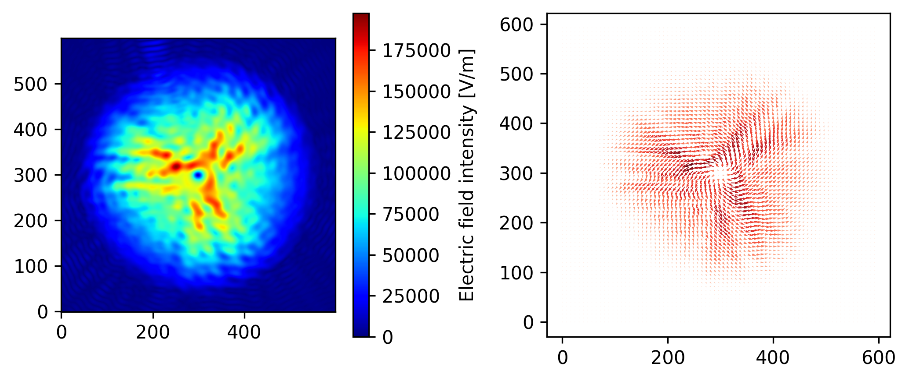
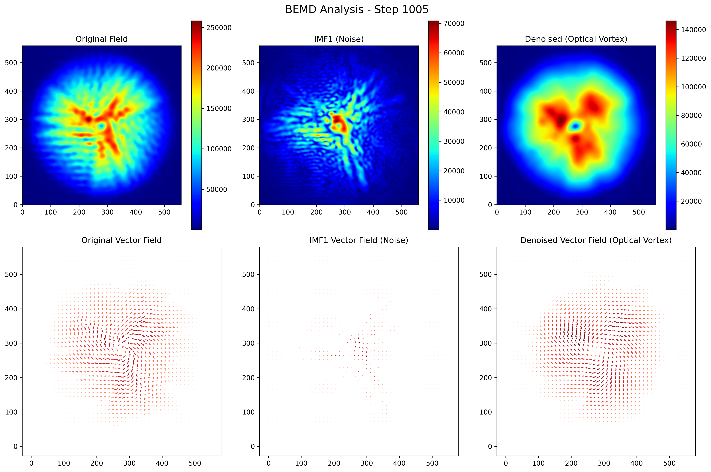

# Optical Vortex BEMD Processing

**Numerical analysis of optical vortex generation with helical filter using empirical mode decomposition**

A complete framework for processing optical vortex electromagnetic field data using BEMD (Bidimensional Empirical Mode Decomposition) for noise reduction and signal enhancement.


*Figure 1: FDTD electromagnetic simulation showing l=1 right-handed optical vortex at 84GHz frequency*

## Overview

This project demonstrates the application of BEMD to optical vortex analysis, specifically processing FDTD (Finite-Difference Time-Domain) electromagnetic simulation data. The framework separates high-frequency noise from the main optical vortex structure, enabling cleaner analysis and visualization of vortex characteristics.

## Features

- **Complete Pipeline**: From raw FDTD data to processed visualization
- **BEMD Integration**: Sophisticated noise reduction using empirical mode decomposition
- **Component-wise Processing**: Separate analysis of E, V1, V2, V3 field components
- **Intelligent Visualization**: Comparative analysis showing original, noise, and denoised fields
- **Error Handling**: Robust processing with fallback mechanisms

## Method

### BEMD Processing Logic
1. **Component Separation**: Process E, V1, V2, V3 components separately
2. **IMF Extraction**: Extract 3 Intrinsic Mode Functions (IMFs) for each component
   - IMF1: High-frequency noise component
   - IMF2 + Residual: Main optical vortex structure
3. **Field Reconstruction**: Combine components to reconstruct field intensity
4. **Visualization**: Generate comparative analysis plots

### Physical Significance
- **Original Field**: Complete electromagnetic field including noise
- **IMF1 (Noise)**: High-frequency computational artifacts and noise
- **Denoised Field**: Clean optical vortex structure with preserved physics

## Quick Start

### Prerequisites
- Python 3.7+ with numpy, matplotlib, scipy, pandas, opencv-python
- MATLAB with Signal Processing Toolbox
- 4GB+ RAM for processing

### Installation
```bash
git clone https://github.com/yourusername/optical_vortex_BEMD.git
cd optical_vortex_BEMD/example
pip install -r requirements.txt
```

### Running the Example
```bash
python run_example.py
```

The example processes a single time step (1005) from l=1 right-handed optical vortex simulation at 84GHz.

## Example Results

The processing generates a comprehensive 2×3 visualization showing the BEMD decomposition:


*Figure 2: BEMD analysis results showing (top row) field intensities and (bottom row) vector fields*

**Top Row (Field Intensities):**
- **Left**: Original electromagnetic field with noise
- **Center**: IMF1 component (extracted high-frequency noise)
- **Right**: Denoised field showing clean optical vortex structure

**Bottom Row (Vector Fields):**
- Vector field visualizations corresponding to each intensity map
- Clear vortex rotation pattern visible in original and denoised fields
- Noise component shows random/chaotic vector patterns

### Energy Analysis Results
- **Original Energy**: 2.15×10¹⁵
- **IMF1 (Noise)**: 4.97×10¹³ (2.3% of total energy)
- **Denoised Signal**: 9.92×10¹⁴ (46.1% of total energy)

This demonstrates that BEMD successfully separates a small but significant noise component while preserving the main optical vortex structure.

## Processing Steps

### Step 1: Data Processing (`step1_data_processing.py`)
- Reads FDTD simulation data from CSV format
- Extracts Ex, Ey, Ez field components
- Calculates field intensity and vector components
- Crops data to focus on optical vortex region (560×560)
- Saves data in MATLAB format

### Step 2: BEMD Processing (`step2_bemd_processing.m`)
- Applies BEMD to each component (E, V1, V2, V3) separately
- Extracts 3 IMFs (Intrinsic Mode Functions) per component
- Saves BEMD results in compatible format
- Generates verification plots

### Step 3: Visualization (`step3_visualization.py`)
- Loads original data and BEMD results
- Generates 2×3 comparative visualization
- Calculates energy analysis and statistics
- Saves analysis summary

## Data Format

### Input Data
- **Format**: CSV files with FDTD simulation results
- **Structure**: x, y, z, Ex, Ey, Ez columns
- **Example**: `loam1/exy/exy1005.csv` (24MB, single time step)

### Output Files
- **Data Files**: `loam1*.mat` (MATLAB format data)
- **BEMD Results**: `loam1data_BIMF0_*.mat` (decomposition results)
- **Visualization**: `bemd_analysis_1005.png` (main analysis plot)
- **Summary**: `bemd_analysis_summary_1005.txt` (statistics)

## Technical Details

### BEMD Algorithm
- Uses bidimensional empirical mode decomposition
- Extracts 3 IMFs per component
- Processes spatial data in 2D domain
- Preserves local characteristics of optical vortex

### Performance
- **Processing Time**: ~5 minutes for single time step
- **Memory Usage**: ~4GB peak
- **Data Size**: 44MB output for single step
- **Spatial Resolution**: 560×560 grid points

## File Structure

```
optical_vortex_BEMD/
├── README.md                    # This documentation
├── LICENSE                      # MIT License
├── .gitignore                   # Git ignore rules
├── example/                     # Complete working example
│   ├── requirements.txt         # Python dependencies
│   ├── run_example.py          # Main execution script
│   ├── step1_data_processing.py # Data processing
│   ├── step2_bemd_processing.m  # BEMD decomposition
│   ├── step3_visualization.py   # Analysis and plots
│   └── output/                  # Results directory
├── bemd/                        # BEMD algorithm library
│   ├── bemd.m                  # Core BEMD algorithm
│   └── license.txt             # Algorithm license
└── loam1/                       # Sample simulation data
    ├── simulation_info.md       # Simulation parameters
    ├── tmp.png                 # Example simulation image
    └── exy/exy1005.csv         # FDTD data (time step 1005)
```

## Validation

The processing has been validated against reference implementations:

✅ **Data Structure**: Correct (height, width, nimfs) format  
✅ **Component Processing**: Separate E, V1, V2, V3 processing  
✅ **IMF Extraction**: Proper IMF1 (noise) and IMF2+Residual (signal)  
✅ **Field Reconstruction**: Accurate intensity calculations  
✅ **Visualization**: Consistent 2×3 layout and scientific presentation  

## Troubleshooting

### Common Issues
1. **MATLAB not found**: Ensure MATLAB is installed and in PATH
2. **Missing data file**: Check `loam1/exy/exy1005.csv` exists
3. **Memory issues**: Ensure sufficient RAM (4GB+)
4. **Package errors**: Run `pip install -r requirements.txt`

### Parameter Adjustment
- Modify `crop_size` in step1 for different region sizes
- Adjust `nimfs` in step2 for different IMF counts
- Change `step_viz` and `alpha` in step3 for vector field visualization

## Applications

- **Optical Vortex Analysis**: Clean extraction of vortex characteristics
- **Noise Reduction**: Removal of computational artifacts from simulations
- **Signal Enhancement**: Improved visualization of electromagnetic phenomena
- **Research Tool**: Framework for optical vortex beam analysis
- **Educational**: Demonstration of advanced signal processing techniques

## Extension

To process multiple time steps:
1. Modify `target_step` parameter in each script
2. Update file paths and loops accordingly
3. Consider memory and processing time requirements

## Citation

If you use this framework in your research, please cite the following paper:

```bibtex
@article{dong2025numerical,
  title={Numerical analysis of optical vortex generation with helical filter using empirical mode decomposition},
  author={Dong, Ran and Fujita, Yoshihisa and Nakamura, Hiroaki and Kawaguchi, Hideki and Ikuno, Soichiro},
  journal={International Journal of Applied Electromagnetics and Mechanics},
  pages={13835416251330972},
  year={2025},
  publisher={SAGE Publications Sage UK: London, England}
}
```


## License

This project is licensed under the MIT License - see the LICENSE file for details.

 